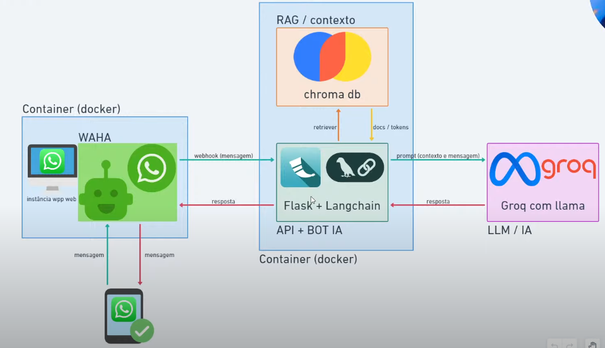

# ChatBot WhatsApp

Este projeto é um chatbot WhatsApp construído com Flask e o framework Waha. Permite criar e gerenciar bots WhatsApp de forma simples através de uma API REST.



## 🛠️ Tecnologias Utilizadas

- **Python 3.11**: Linguagem principal do projeto
- **Flask 3.1.1**: Framework web para criação da API REST
- **Requests 2.32.4**: Biblioteca para requisições HTTP
- **Waha (devlikeapro/waha)**: Framework para integração com WhatsApp via Docker
- **Docker & Docker Compose**: Containerização e orquestração dos serviços

## 📋 Bibliotecas Python

```
Flask==3.1.1          # Framework web
requests==2.32.4      # Cliente HTTP
blinker==1.9.0        # Sistema de sinais Flask
Jinja2==3.1.6         # Template engine
Werkzeug==3.1.3       # WSGI utilities
```

## 🏗️ Arquitetura do Projeto

O projeto segue uma arquitetura simples baseada em microserviços:

```
├── app.py              # Aplicação principal Flask
├── services/
│   ├── __init__.py
│   └── waha.py         # Service para comunicação com Waha
├── docker-compose.yml  # Orquestração dos containers
├── Dockerfile.api      # Container da API Python
└── requirements.txt    # Dependências Python
```

### Padrões de Projeto Utilizados

- **Service Layer Pattern**: Separação da lógica de negócio em `services/waha.py`
- **Dependency Injection**: Instanciação do serviço Waha no endpoint
- **RESTful API**: Endpoint seguindo convenções REST

## ⚙️ Setup e Configuração

### Pré-requisitos

- Docker
- Docker Compose

### Instalação e Execução

1. **Clone o repositório:**

```bash
git clone <repository-url>
cd ChatBot-WhatsApp
```

2. **Execute os containers:**

```bash
docker-compose up -d
```

3. **Verifique os serviços:**

- **API Flask**: http://localhost:5000
- **Waha Dashboard**: http://localhost:3000

### Configuração do WhatsApp

1. Acesse o painel do Waha em `http://localhost:3000`
2. Configure uma nova sessão WhatsApp
3. Escaneie o QR Code com seu WhatsApp
4. Configure o webhook para `http://api:5000/api/chatbot/webhook/`

## 📡 API Endpoints

### POST /api/chatbot/webhook/

Recebe webhooks do Waha e responde automaticamente às mensagens.

**Request Body:**

```json
{
  "payload": {
    "from": "5511999999999@c.us",
    "body": "Mensagem recebida"
  }
}
```

**Response:**

```json
{
  "status": "success"
}
```

## 🔧 Configuração Avançada

### Variáveis de Ambiente

Para configurações personalizadas, modifique as seguintes variáveis:

- **WAHA_URL**: URL do serviço Waha (padrão: `http://waha:3000`)
- **FLASK_DEBUG**: Modo debug da aplicação Flask
- **SESSION_NAME**: Nome da sessão WhatsApp (padrão: `default`)

### Personalização da Resposta

Edite o arquivo `app.py` para customizar as respostas automáticas:

```python
waha.send_message(
    chat_id=chat_id,
    message='Sua mensagem personalizada aqui',
)
```

## 🚀 Deploy

Para deploy em produção, remova o modo debug do `docker-compose.yml` e configure variáveis de ambiente apropriadas.
